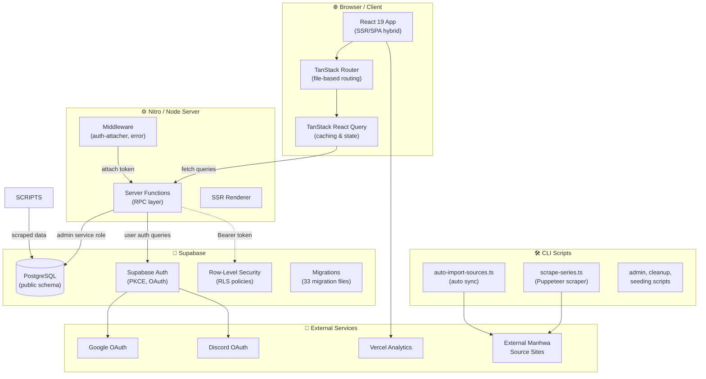
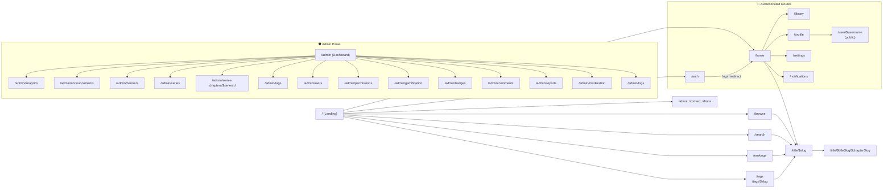
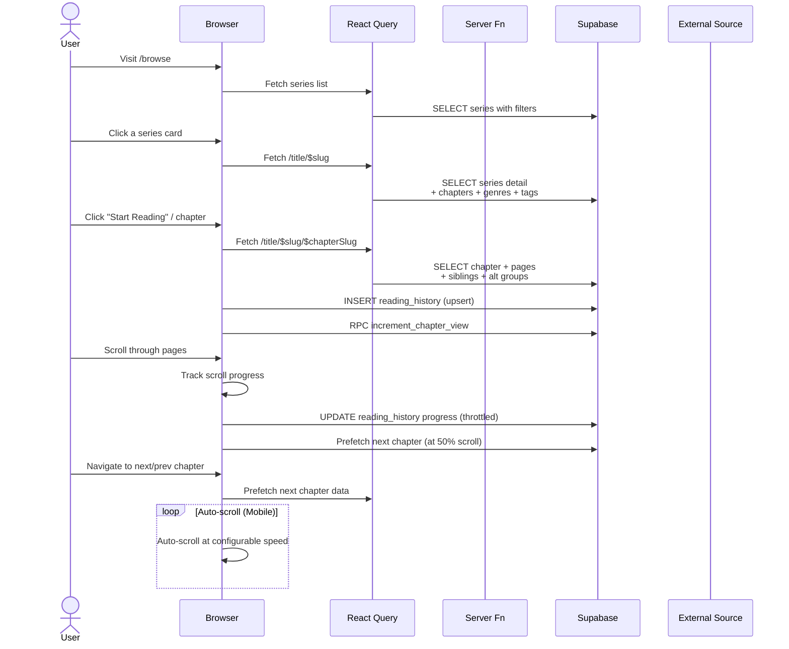
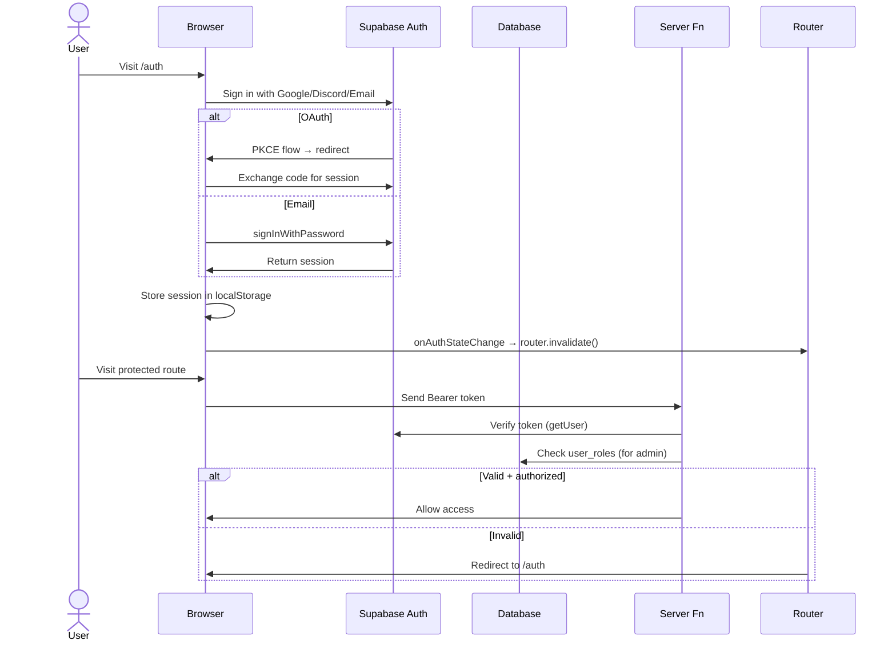
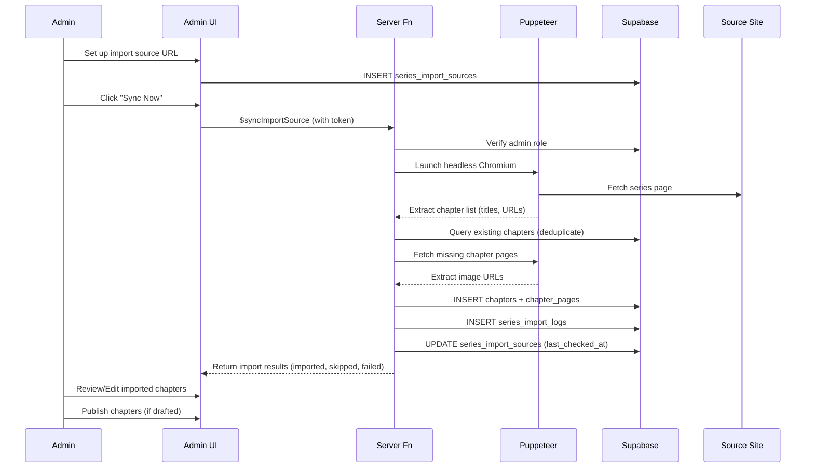
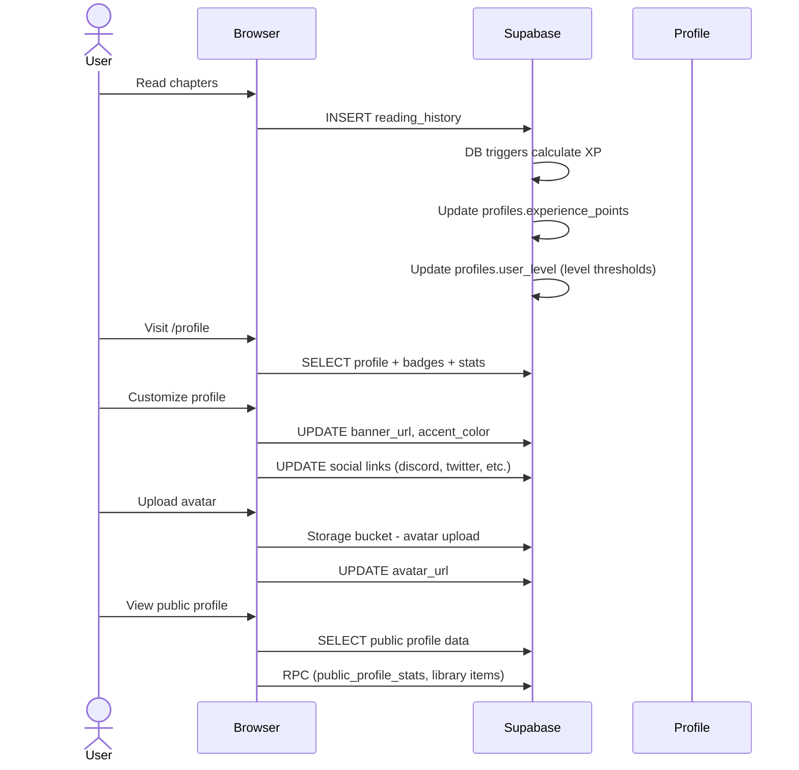
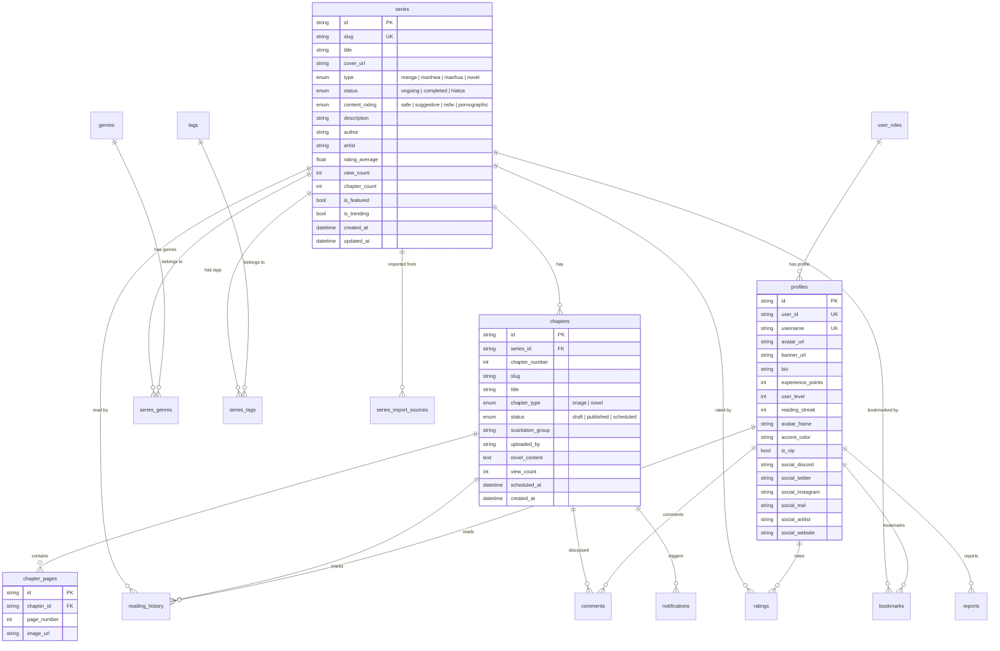

# 🌐 Shadow Shelf (vnrscans) — Workflow Overview

> A comprehensive site workflow & architecture for **vnrscans**, a full-stack manga/manhwa/manhua/novel reading platform built with React, TanStack, Supabase, and Vite.

---

## 🏗️ Tech Stack

| Layer       | Technology                                                                 |
|-------------|---------------------------------------------------------------------------|
| **Frontend** | React 19, TanStack Router, TanStack React Query, TanStack React Start    |
| **Styling**  | Tailwind CSS 4, Radix UI / shadcn/ui primitives, Lucide icons             |
| **Backend**  | TanStack Server Functions (RPC), Nitro server, Node.js                    |
| **Database** | Supabase PostgreSQL (RLS, migrations, auto-generated TypeScript types)    |
| **Auth**     | Supabase Auth (PKCE flow) — Google OAuth, Discord OAuth, Email/Password    |
| **Bundler**  | Vite 7                                                                     |
| **Server**   | Express via TanStack React Start (Nitro)                                  |
| **Scraping** | Puppeteer + Chromium for automatic chapter import                         |
| **Deploy**   | Vercel (with Vercel Analytics)                                            |
| **Lang**     | TypeScript (strict)                                                        |

---

## 🗺️ High-Level Architecture Diagram



---

## 🧭 Full Route Map



---

## 🧩 Core Workflows

### 1. 📖 User Reading Workflow



### 2. 🔐 Authentication & Authorization Workflow



### 3. ⚙️ Content Import (Scraper) Workflow



### 4. 🏆 Gamification & Profile Workflow



---

## 🗄️ Database Schema (Core Tables)



---

## 📁 Project Structure

```
shadow-shelf/
├── src/
│   ├── routes/               # File-based routing (TanStack Router)
│   │   ├── __root.tsx         # Root layout (navbar, footer, theme, auth listener)
│   │   ├── index.tsx          # Landing page
│   │   ├── auth.tsx           # Login/signup (Google, Discord, Email)
│   │   ├── home/              # Authenticated home (history, continue)
│   │   ├── browse.tsx         # Browse with filters
│   │   ├── search.tsx         # Search results
│   │   ├── title.$slug.tsx    # Series detail + chapters + recommendations
│   │   ├── title.$titleSlug.$chapterSlug.tsx  # Reader (image/novel)
│   │   ├── rankings.tsx       # Top rated, trending, most viewed/followed
│   │   ├── tags.tsx / tags.$slug.tsx  # Tags/genre pages
│   │   ├── user.$username.tsx  # Public profile
│   │   ├── about.tsx, contact.tsx, dmca.tsx  # Static pages
│   │   ├── _authenticated.tsx  # Auth guard wrapper
│   │   └── _authenticated/    # Protected routes
│   │       ├── library.tsx    # User's library (reading, completed, etc.)
│   │       ├── profile.tsx    # Profile customization
│   │       ├── settings.tsx   # Account settings
│   │       ├── notifications.tsx  # Notification history
│   │       └── admin/         # Admin panel (17 subpages)
│   │           ├── index.tsx, analytics.tsx, series.tsx, chapters...
│   ├── components/
│   │   ├── ui/                # Radix UI / shadcn primitives (~50 components)
│   │   ├── Navbar.tsx, Footer.tsx, AnnouncementBanner.tsx
│   │   ├── SeriesCard.tsx, SeriesGrid.tsx
│   │   ├── HomeHeroCarousel.tsx
│   │   ├── OptimizedImage.tsx
│   │   ├── DiceRollOverlay.tsx
│   │   ├── admin/             # Admin-specific components
│   │   ├── notifications/     # NotificationBell, NotificationList
│   │   └── profile/           # Profile widgets (badges, heatmap, etc.)
│   ├── contexts/
│   │   ├── ThemeContext.tsx    # Dark/theme provider
│   │   └── ReaderSettingsContext.tsx  # Reader configuration
│   ├── hooks/
│   │   ├── useAuth.ts         # Auth state hook
│   │   ├── use-mobile.tsx     # Responsive detection
│   │   └── useDragScroll.ts   # Drag-based carousel scrolling
│   ├── integrations/
│   │   ├── supabase/
│   │   │   ├── client.ts      # Client-side Supabase (anon key, PKCE)
│   │   │   ├── client.server.ts  # Server-side (service role key)
│   │   │   ├── auth-attacher.ts  # Middleware: attaches Bearer token
│   │   │   └── types.ts      # Auto-generated DB types (650+ lines)
│   │   └── lovable/           # Lovable.dev cloud integration
│   ├── lib/
│   │   ├── api/               # Server Functions
│   │   │   ├── admin.functions.ts    # $deleteUser (admin-only)
│   │   │   ├── scraper.functions.ts  # $extractChaptersFromUrl, $extractImagesFromUrl, $syncImportSource
│   │   │   └── example.functions.ts
│   │   ├── auth-guards.ts     # requireAuthenticatedUser()
│   │   ├── chapter-scraper.ts # Puppeteer scraping logic
│   │   ├── chapter-utils.ts   # Slug building
│   │   ├── import-source-utils.ts  # Source detection
│   │   ├── search-utils.ts    # Search/build filters
│   │   ├── layout.ts          # Reader layout detection
│   │   ├── error-capture.ts / error-page.ts  # SSR error handling
│   │   ├── lovable-error-reporting.ts  # Remote error logging
│   │   ├── brand.ts           # Brand constants
│   │   └── utils.ts           # CN helper, profile ID, admin log, badges
│   ├── server.ts              # SSR entry (error normalization)
│   ├── start.ts               # App bootstrap (middleware registration)
│   ├── router.tsx             # Router factory (QueryClient config)
│   ├── routeTree.gen.ts       # Auto-generated route tree
│   └── styles.css             # Tailwind CSS + animations
├── scripts/                   # CLI automation
│   ├── scrape-series.ts       # Puppeteer batch scraping
│   ├── auto-import-sources.ts # Scheduled auto-sync
│   ├── check-database.ts      # DB health checks
│   ├── grant-admin.ts         # Grant admin role
│   ├── clear-database.ts      # DB cleanup
│   ├── generate-sitemap.js    # SEO sitemap generation
│   └── (14 more utility scripts)
├── supabase/
│   ├── config.toml            # Supabase local config
│   └── migrations/            # 33 SQL migration files
│       ├── 0000_initial.sql
│       ├── profiles, series, chapters, pages
│       ├── auth RLS policies, user_roles
│       ├── gamification (XP, levels, streaks)
│       ├── notifications, comments, reports
│       ├── import sources, scrapers
│       ├── analytics views, admin logs
│       └── carousel, banners, announcements
├── package.json               # Dependencies & scripts
├── vite.config.ts             # Vite configuration
├── tsconfig.json              # TypeScript config
└── vercel.json                # Deployment config
```

---

## 🔄 Data Flow Summary

```
┌─────────────────────────────────────────────────────────────────┐
│                        EXTERNAL SOURCE                          │
│                    (e.g., qimanhwa.com, etc.)                   │
└──────────────────────┬──────────────────────────────────────────┘
                       │
                       ▼
┌─────────────────────────────────────────────────────────────────┐
│          SCRAPER PIPELINE (Puppeteer + Chromium)                │
│                                                                 │
│  scripts/scrape-series.ts  ─►  lib/chapter-scraper.ts           │
│  lib/api/scraper.functions.ts  ─►  $syncImportSource            │
│                                                                 │
│  1. Extract chapter list from external URL                      │
│  2. Extract image URLs from each chapter page                   │
│  3. Filter & validate images                                    │
│  4. Bulk insert chapters + chapter_pages                        │
│  5. Log results, update source status                           │
└──────────────────────┬──────────────────────────────────────────┘
                       │
                       ▼
┌─────────────────────────────────────────────────────────────────┐
│                   SUPABASE POSTGRESQL                           │
│                                                                 │
│  series ──► chapters ──► chapter_pages                         │
│  series ──► series_genres ──► genres                            │
│  series ──► series_tags ──► tags                                │
│  profiles ──► reading_history ──► chapters                      │
│  profiles ──► library (user_library)                            │
│  profiles ──► ratings ──► series                                │
│  profiles ──► comments ──► chapters / series                    │
│  profiles ──► user_roles (RBAC)                                │
│  series_import_sources ──► series_import_logs                   │
└──────────────┬──────────────────────────────────────────────────┘
               │
               ▼
┌─────────────────────────────────────────────────────────────────┐
│              TANSTACK REACT QUERY (Caching Layer)               │
│                                                                 │
│  staleTime: 2-15 min  │  gcTime: 10-30 min                     │
│  retry: 1 │ refetchOnWindowFocus: false                        │
│  defaultPreload: "intent" │ preloadStaleTime: 30s              │
└──────────────┬──────────────────────────────────────────────────┘
               │
               ▼
┌─────────────────────────────────────────────────────────────────┐
│                    REACT UI COMPONENTS                          │
│                                                                 │
│  Landing Page ─► Hero + Featured + Value Props + FAQ            │
│  Browse      ─► Search bar + Filters + Grid/List view           │
│  Series Detail ─► Cover + Metadata + Chapter Table + Recs       │
│  Reader      ─► Image pages / Novel text + Controls + Comments  │
│  Profile     ─► Stats + Badges + Heatmap + Customization        │
│  Admin Panel ─► CRUD tables + Analytics + User Mgmt             │
└─────────────────────────────────────────────────────────────────┘
```

---

## 🔐 Authentication Flow Detail

```
User navigates to /auth
├── Google OAuth ──► Supabase PKCE ──► Redirect back ──► Session stored
├── Discord OAuth ──► Supabase PKCE ──► Redirect back ──► Session stored
└── Email/Password ──► supabase.auth.signInWithPassword() ──► Session

On every page load:
  ├── useAuth() hook listens to onAuthStateChange
  ├── Root component invalidates router & query cache on session change
  └── Authenticated routes call requireAuthenticatedUser() beforeLoad

Server Function calls:
  ├── auth-attacher middleware grabs access_token from session
  └── Attaches Authorization: Bearer <token> header to serverFn RPCs

Admin authorization:
  ├── Supabase getUser() confirms the user
  ├── Check user_roles table for admin/moderator/uploader
  └── Service role client bypasses RLS for admin operations
```

---

## 🧪 Migration Timeline (33 Migrations)

```
2026-06-02  Initial schema: series, chapters, chapter_pages, profiles, etc.
            + user_library, content_rating, view_count RPCs
2026-06-03  Chapter uploader fields, reactions, chapter_count
            + User stats/preferences, most_followed function
            + Analytics, tags, admin platform features
            + RLS fixes, demo banners, carousel, achievements
2026-06-04  Profile enhancements (banner, accent, social links)
            + Notifications, avatars bucket, tags→genres migration
            + RLS fixes, privacy settings, public profile RPCs
2026-06-05  Avatar frames, scanlation group chapters
2026-06-06  Series import sources (auto-scraping)
2026-06-07  Carousel limit updates, chapter comments threads
```

---

## 🧠 Error Handling Strategy

```
Server-side (SSR):
  ├── errorMiddleware in start.ts catches all server function errors
  ├── normalizeCatastrophicSsrResponse() handles h3 swallow errors
  ├── renderErrorPage() produces clean HTML error page
  └── Error capture library (error-capture.ts) stores last error

Client-side:
  ├── errorComponent in root route handles rendering errors
  ├── notFoundComponent for 404 pages
  ├── lovable-error-reporting.ts sends error to remote service
  └── TanStack Query retry=1 handles transient fetch failures

Reader-specific:
  ├── Image error retry (2 retries with progressive delay)
  ├── Scroll position restoration from localStorage
  └── Chapter prefetching at 50% scroll progress
```

---

## 📦 Deployment & Build Pipeline

```
Build (npm run build):
  1. vite build ──► Bundled JS + CSS
  2. copy-chromium-assets.js ──► Copy Chromium for serverless
  3. generate-sitemap.js ──► SEO sitemap.xml

Deploy targets:
  ├── Vercel (primary)
  │   ├── Edge functions for SSR
  │   ├── Vercel Analytics auto-instrumented
  │   └── Environment variables: SUPABASE_URL, SERVICE_ROLE_KEY, etc.
  └── Supabase (database & auth)

Preview (npm run dev):
  ├── Vite dev server with HMR
  ├── TanStack Router dev tools
  └── Supabase local via CLI
```

---

> **Note:** This document is auto-generated from codebase analysis. The Mermaid diagrams render in GitHub, VS Code (with extension), or any markdown viewer that supports Mermaid.